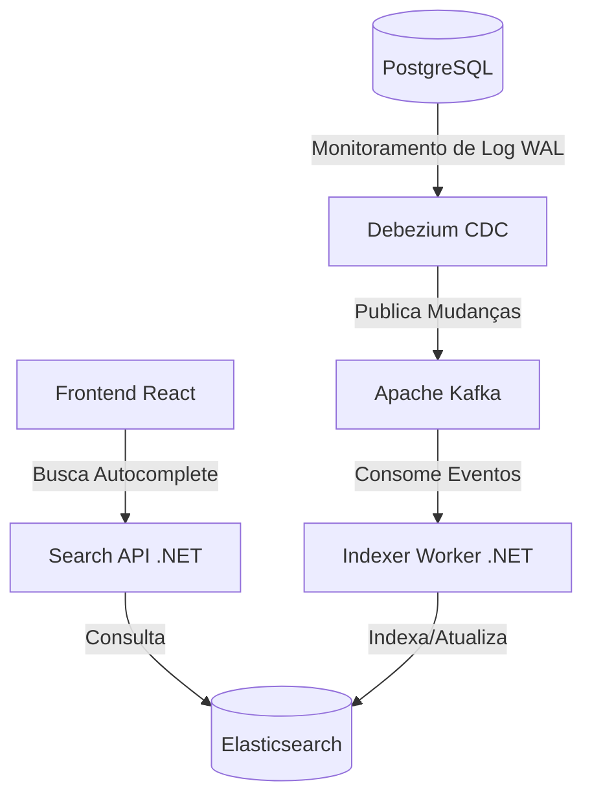

# 🎫 Documentação do Sistema: Event Search POC

Este sistema é uma demonstração de **Arquitetura Baseada em Eventos** utilizando o padrão **CQRS** (Command Query Responsibility Segregation) e **CDC** (Change Data Capture). O objetivo é fornecer uma busca ultra-rápida e resiliente, onde o banco de dados principal e o motor de busca estão sempre sincronizados.

## 🏗️ Arquitetura Geral

A aplicação é dividida em serviços independentes que se comunicam de forma assíncrona:



---

## 🧩 Componentes do Sistema

### 1. Persistência: PostgreSQL
É a nossa **"Fonte da Verdade"**. Todos os dados oficiais de eventos residem aqui. 
- **Diferencial:** O Postgres está configurado com `wal_level=logical`. Isso permite que o banco escreva todas as alterações em um log binário (Write-Ahead Log) que pode ser lido externamente.

### 2. Sincronização: Debezium & Kafka
Em vez de fazer o backend salvar os dados no Postgres e no Elasticsearch ao mesmo tempo (o que pode gerar inconsistência), usamos o Debezium.
- **Debezium:** Ele "funde" com o log do Postgres. Sempre que um `INSERT` ou `UPDATE` acontece, o Debezium percebe e gera um evento JSON.
- **Kafka:** Atua como o mensageiro inquebrável. Ele recebe o evento do Debezium e o armazena em um tópico (`postgres.public.events`) até que alguém esteja pronto para ler.

### 3. Processamento: Indexer Worker (.NET 8)
Um serviço que roda em background (sem interface HTTP).
- **Função:** Ele "escuta" o Kafka continuamente. 
- **Lógica:** Ao receber uma mensagem, ele a traduz e a envia para o Elasticsearch. Se o Elasticsearch estiver fora do ar, o Worker para e tenta novamente depois, garantindo que nenhum dado seja perdido (resiliência).

### 4. Motor de Busca: Elasticsearch
O "cérebro" da pesquisa.
- **Autocomplete:** Configuramos um analyzer chamado `edge_ngram`. Ele quebra as palavras em pedaços (ex: "Coldplay" vira "C", "Co", "Col"...), permitindo que o usuário encontre resultados antes mesmo de terminar de digitar.

### 5. Consulta: Search API (.NET 8)
Uma API mínima e ultra-rápida.
- **Regra de Ouro:** Ela **nunca** toca no PostgreSQL. Sua única função é traduzir as requisições do Frontend em consultas otimizadas para o Elasticsearch.

### 6. Interface: Frontend (React + Vite)
Uma aplicação moderna em TypeScript.
- **UX:** Implementa um **Debounce**. Quando você digita, o React espera 300ms de silêncio antes de chamar a API. Isso evita sobrecarregar o servidor com requisições desnecessárias a cada letra digitada.

---

## 🔄 Fluxo de um Dado (A Jornada do Evento)

1.  **Inserção:** Você insere um show no Postgres: `INSERT INTO events (name) VALUES ('Lollapalooza');`.
2.  **Captura:** O Postgres escreve isso no log WAL. O **Debezium** lê o log e publica no **Kafka**.
3.  **Transporte:** O **Kafka** garante que a mensagem está salva e disponível.
4.  **Indexação:** O **Indexer Worker** consome a mensagem do Kafka e a envia para o **Elasticsearch**.
5.  **Disponibilidade:** Agora, o Elasticsearch tem o "Lollapalooza" quebrado em pedaços para o autocomplete.
6.  **Busca:** O usuário digita "Lolla" no **React**, a **Search API** consulta o Elasticsearch e o resultado aparece na tela instantaneamente.

---

## 🚀 Vantagens desta Abordagem

*   **Performance:** A busca não pesa no banco de dados principal. O Postgres fica livre para transações, enquanto o Elasticsearch cuida das pesquisas complexas.
*   **Desacoplamento:** Se o Elasticsearch cair, o banco Postgres continua funcionando. Quando o Elasticsearch voltar, o Worker vai ler as mensagens acumuladas no Kafka e atualizar tudo automaticamente.
*   **Escalabilidade:** Cada parte pode crescer separadamente. Se você tiver milhões de buscas, pode escalar apenas a `Search API` e o `Elasticsearch`.

---

## 🛠️ Comandos Úteis para Operação

*   **Ver Logs do Sincronismo:**
    ```bash
    docker logs -f indexer-worker
    ```
*   **Verificar o que está no motor de busca:**
    ```bash
    curl http://localhost:9200/events/_search?pretty
    ```
*   **Inserir novo dado via terminal:**
    ```bash
    docker exec postgres psql -U user -d events_db -c "INSERT INTO events (name) VALUES ('Novo Evento Exemplo');"
    ```
